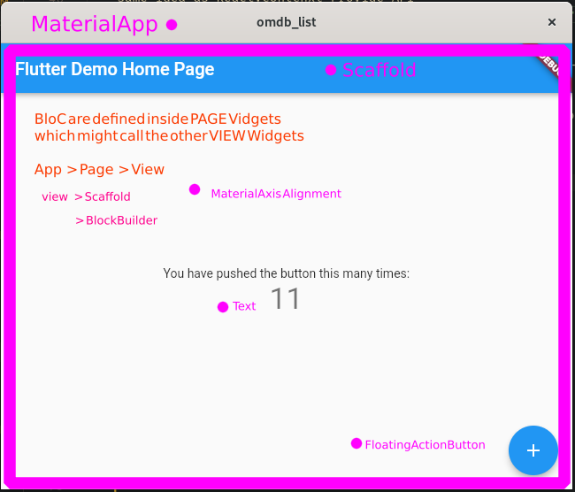

# Development Workflow

> Not managing states properly is one of the major SINs of softeware Development

1. Identify states and dynamic content in your web apps
2. Seperate static from dynamic
3. Introduce state boilerplate using snippet
   1. Introduce state variables and bind them to events, like scroll
4. Add Infinite scrolling
5. Add interactivity, `onTap` on **ListTile**
6. Add routes `MaterialPageRoute`
7. customize theme

## Build app from scratch

1. create new project scaffold
2. remove everything and add `materialApp` boilerplate
3. Add UI for composing chat
4. consume API in flutter using BloC Pattern
5. Add/remove dependencies to project

## Enterprise app

```
mkdir -pv ./lib/{bloc,model,pages,repository,style,widgets}
flutter packages get
mkdir -pv {core/constants,core/exceptions,core/themes}
mkdir -pv {data/http,data/models,data/repositories}
mkdir -pv {logic/bloc,logic/cubit,logic/debug}
mkdir -pv {presentation/router,presentation/screens}
```

Enter the reactive programming concepts

| item          | description                                                      |
| ------------- | ---------------------------------------------------------------- |
| BlocOverrides | facility constructor to override observers for all state changes |

- top level page widget is `stateless`
- `stateful` widgets are inside sttateless widgets
- Page widget has a `BlocProvider` inside build method



### Examples

- https://github.com/TheWCKD/blocFromZeroToHero
